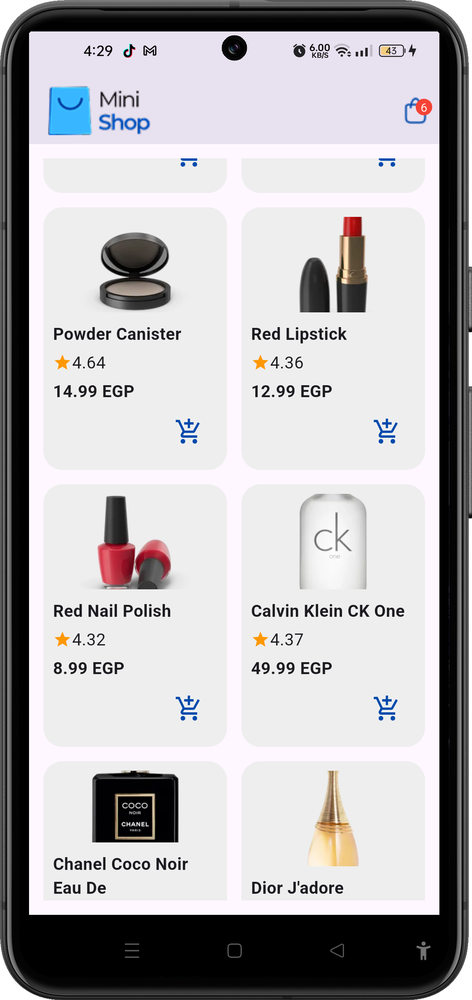
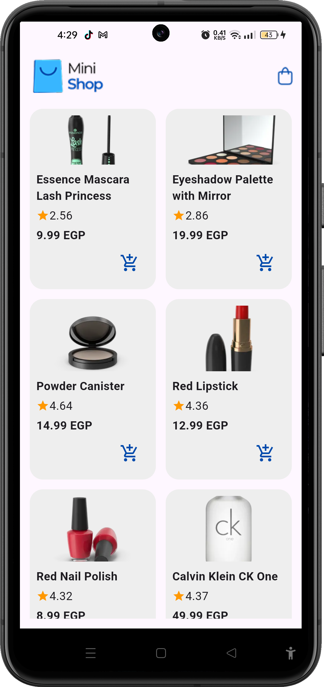
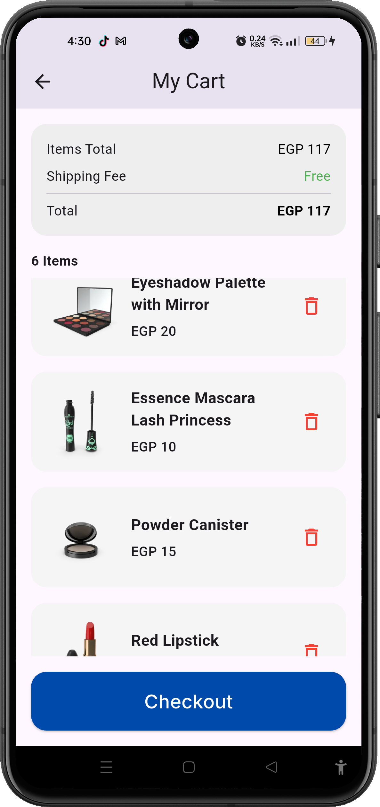

# 🛒 Shopping Cart

## 📌 Description

A simple and clean Flutter shopping cart app that lets users browse products fetched from a remote API, add them to a cart, review the total price, and proceed to checkout.

---

## ✨ Features

- 🔍 Browse products in a responsive grid layout
- ➕ Add items to the cart with a single tap
- 🗑️ Remove items from the cart
- 💰 View items total and overall total price
- 🚚 Free shipping displayed at checkout
- 🛒 Live cart badge showing item count
- ✅ Checkout button on the cart screen

---

## 🛠 Tech Stack

| Technology | Usage |
|---|---|
| **Flutter** | UI framework |
| **Dart** | Programming language |
| **Provider** | State management |
| **HTTP** | REST API calls |
| **DummyJSON API** | Products data source (`dummyjson.com`) |
| **Google Fonts** | Custom typography |

---

## 📸 Screenshots

<p float="left">
  
  
  
</p>

---

## ▶️ How to Run

1. **Clone the repository**
   ```bash
   git clone https://github.com/fatmanagaa/shopping_cart.git
   cd shopping_cart
   ```

2. **Install dependencies**
   ```bash
   flutter pub get
   ```

3. **Run the app**
   ```bash
   flutter run
   ```
